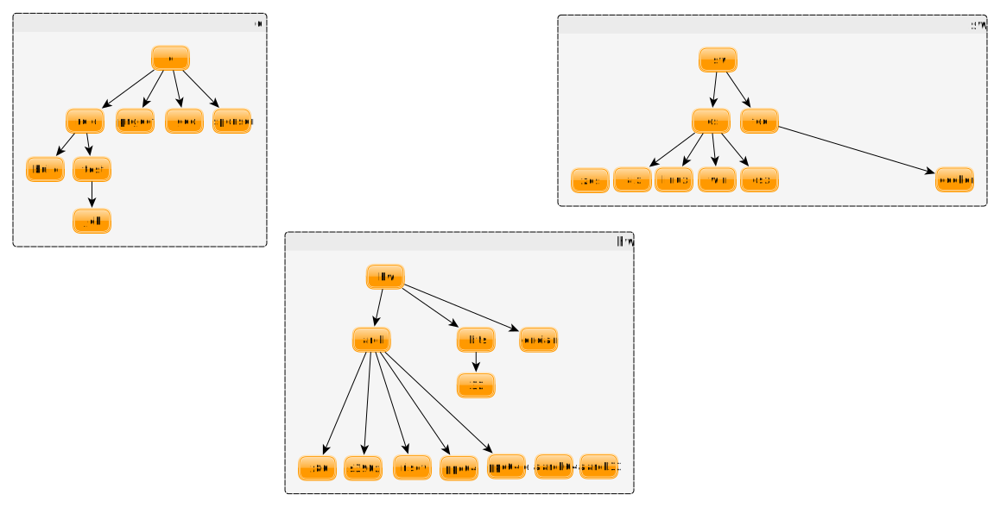

<!--
 Licensed under the Apache License, Version 2.0 (the "License");
 you may not use this file except in compliance with the License.
 You may obtain a copy of the License at

 [1]https://www.apache.org/licenses/LICENSE-2.0

 Unless required by applicable law or agreed to in writing, software
 distributed under the License is distributed on an "AS IS" BASIS,
 WITHOUT WARRANTIES OR CONDITIONS OF ANY KIND, either express or implied.
 See the License for the specific language governing permissions and
 -->

# Schema for Jenkins Labels


## The Schema Tree



  
## Actual Labels and Consumers

If we work on the principle that we only add a label if the build and test automation scripts require it in order to differentiate a machine, then the list is fairly small.  The real reference to what is actively used by test pipelines can be found in the PLATFORM_MAP defined in the [openjdk_tests file](https://github.com/AdoptOpenJDK/openjdk-tests/blob/master/buildenv/jenkins/openjdk_tests#L3).

If you are considering adding a new label for use by pipelines, it should logically fit into one of the 3 top-level categories, ci, hw, or sw, denoting labels relating to the ci, or specific to hardware or software capabilities.  There are already cases where the schema was not followed and arch names contain bits and endian info, rather than appending those labels separately.  

The main reason for following an explicit and documented schema is that it helps for automatically categorizing the types of test failures, improving our ability to triage releases quickly.  It can also help infrastructure hone in on particular problems specific to a subset of machines.

```
 //./
 //├── ci
 //├────── role
 //├────────── build
 //├────────── test
 //├────────────── jck
 //├────── project
 //├────── geo
 //├────── sponsor
 //├── hw 
 //├────── arch
 //├────────── aarch32
 //├────────── aarch64
 //├────────── s390x
 //├────────── ppc64
 //├────────── ppc64le
 //├────────── x86
 //├────────── sparcv9
 //├────────── riscv
 //├────── bits
 //├────────── 32
 //├── sw 
 //├────── os
 //├────────── aix
 //├────────── linux
 //├────────── osx
 //├────────── sunos
 //├────────── windows
 //├────────── zos
 //├────── tool
 //├────────── docker
 ```


